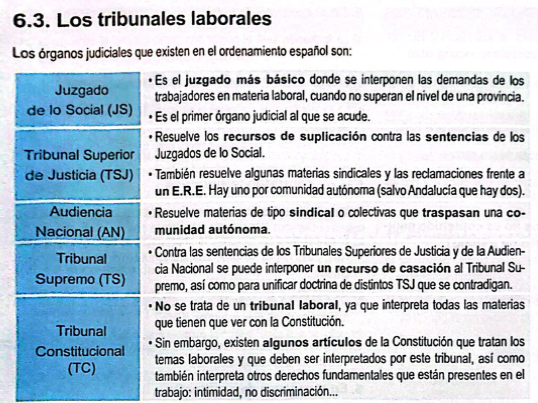

### Ejer21
a) Sí de imagen, pero no se sonido. Porque para grabar el sonido, tiene formar parte de la grabación.
b) Se debe tener sospechas claras de su necesidad.
c) Advertir a los trabajadores mediante la firma de un documento. Porque la empresa debe tener una copia de ese contrato.
d) Sí, en caso de que se sospeche de que alguien está robando algo de la empresa o trabajadores.
e) Se respetará al máximo la seguridad y dignidad de trabajo.
f) Revisión médica de un médico de la Seguridad Social o de la Mutua. Puede contratar a un médico externo.

### Ejer22
a) Puede sancionar al trabajador. Debe revisar el convenio colectivo para saber qué gravedad tiene la falta. 
b) Puede reclamar ante un Juzgado de lo Social en un plazo de 20 días hábiles.
c) 20 días hábiles

### Ejer23
a) La única legal es la suspensión del empleo y sueldo. No va a trabajar, así no cobra ese día.
b) Sí, ha prescrito
c) 20 días hábiles.

