# Fase 1: Windows
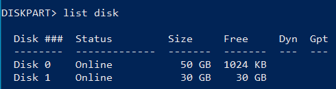

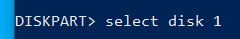

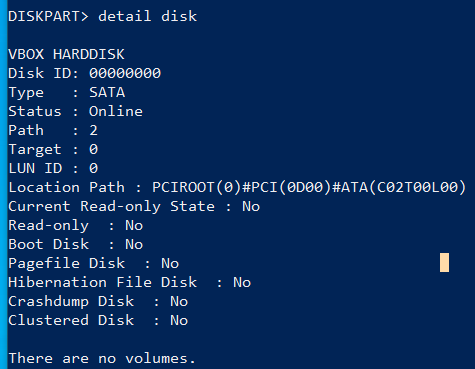

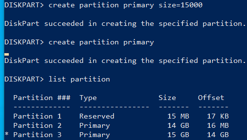

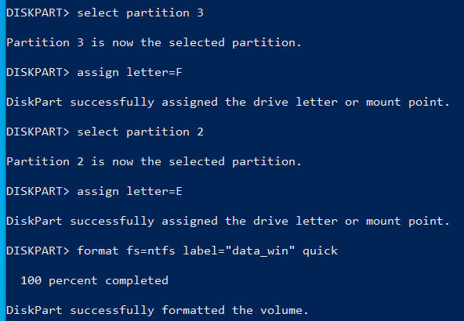

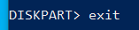

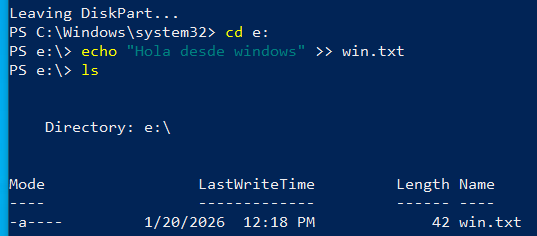


# Fase2: Linux
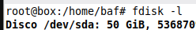

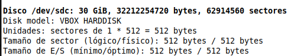

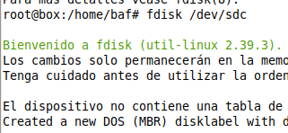

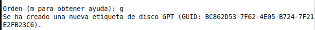

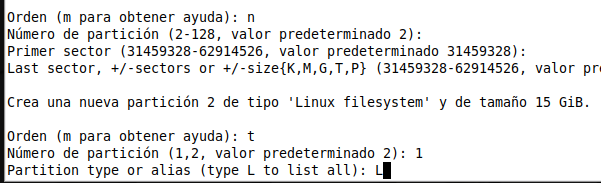

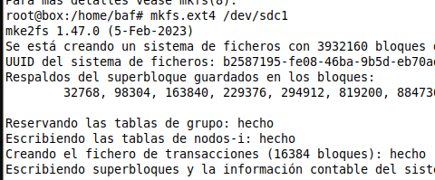

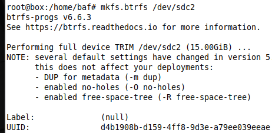

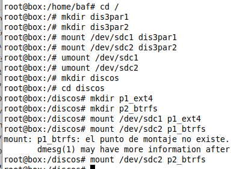

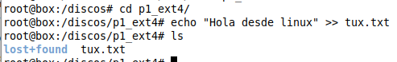

# Fase 3

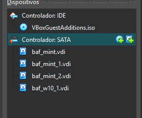

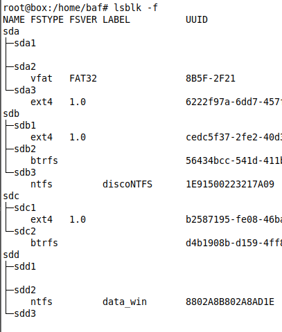

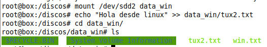


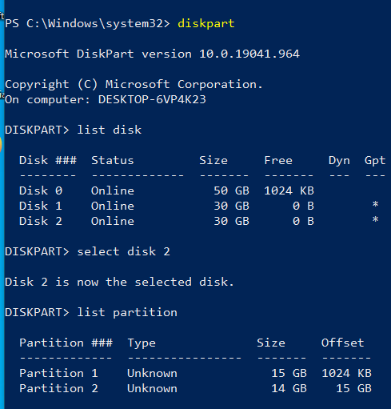


```bash
Set-ExecutionPolicy Bypass -Scope Process -Force
[System.Net.ServicePointManager]::SecurityProtocol = [System.Net.ServicePointManager]::SecurityProtocol -bor 3072
iex ((New-Object System.Net.WebClient).DownloadString('https://community.chocolatey.org/install.ps1'))
```

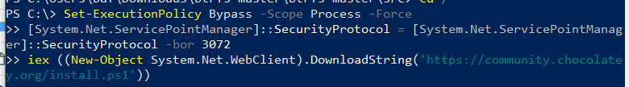

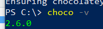

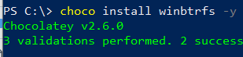

Instalar [Paragon](https://www.paragon-software.com/home/linuxfs-windows/#)


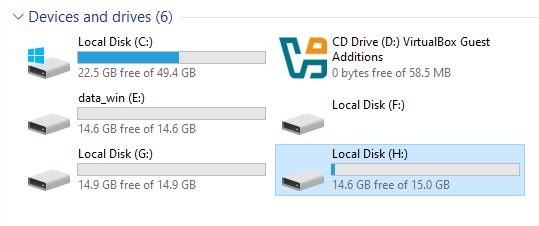

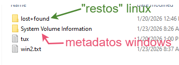


